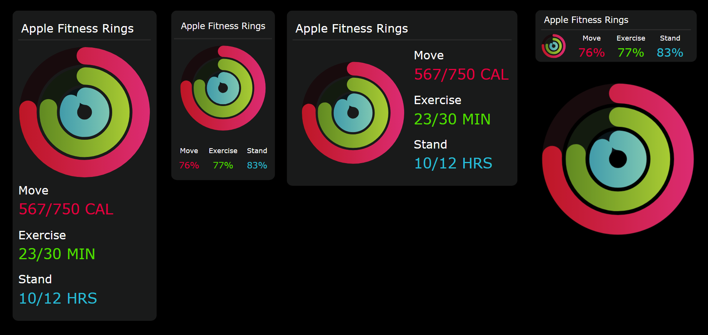

## Visuals Included
- [Vertical Card with Values](./Visuals/Card-Vertical-With-Values/)
- [Vertical Card with Percents](./Visuals/Card-Vertical-With-Percents/)
- [Horizontal Card with Values](./Visuals/Card-Horizontal-With-Values/)
- [Horizontal Card with Percents](./Visuals/Card-Vertical-With-Percents/)
- [Rings only](./Visuals/Rings-Only/)  

## How to Use 

You can find an example Power BI File [Apple Fitness Rings.pbib](https://github.com/adamcamp7/Power-BI-SVG-Visuals/blob/main/Apple%20Fitness%20Rings/Power%20BI%20File/Apple%20Fitness%20Rings.pbip) in the repo that will have a sample data model and the visuals set up as measures. 

When using SVG visuals you need to download the [HTML Content](https://appsource.microsoft.com/en-us/product/power-bi-visuals/wa200001930?tab=overview) visual as an add-on in Power BI.

### Adding DAX variables into the html code

When you create the final code remember that the quotes inside the html code must all be single quote. You will be creating the string in the final code variable and that needs to start and end with the double quote. 

When adding a value between strings you need to concatenate with the & sign and put the DAX variable between. 

```
" & Ring1_Offset_Value & "
```


### Creating Values for the Rings

First, you need to create values for the rings. You need a goal or target value, which is the value you wish to reach to fill the ring. Then you need a metric that is going towards that goal. Once you have both of those values, you can create the percentage. After calculating the percentage, you can subtract the percentage from 100 to get the offset value. This is the value you will use in the ring settings to let the visual know when to stop. 

```dax
VAR Ring1_Goal = SUM('Ring Goal'[GoalCalories]) 
VAR Ring2_Goal = SUM('Ring Goal'[GoalExercise]) 
VAR Ring3_Goal = SUM('Ring Goal'[GoalStand]) 

VAR Ring1_Value = SUM('Ring Data'[Calories]) 
VAR Ring2_Value = SUM('Ring Data'[Exercise]) 
VAR Ring3_Value = SUM('Ring Data'[Stand]) 

VAR Ring1_Percentage = DIVIDE(Ring1_Value, Ring1_Goal) * 100 
VAR Ring2_Percentage = DIVIDE(Ring2_Value, Ring2_Goal) * 100 
VAR Ring3_Percentage = DIVIDE(Ring3_Value, Ring3_Goal) * 100 

VAR Ring1_Offset_Value = IF(Ring1_Percentage >= 100, 0, 100 - Ring1_Percentage)
VAR Ring2_Offset_Value = IF(Ring2_Percentage >= 100, 0, 100 - Ring2_Percentage)
VAR Ring3_Offset_Value = IF(Ring3_Percentage >= 100, 0, 100 - Ring3_Percentage)
```

### Using CSS Variable to assign the settings of the rings

Inside of these CSS variables you can define ring width, color, background color, speed, offset and value. 

```css
/* All Rings */
      --ring-width: 36px; /* Set the stroke width of each ring */

/* Move Ring 1 Outter */
      --move-ring-color: url(#Ring_Outside); /*Use url for gradient and hex code for solid colors */
      --move-ring-bg-color: #200c0e;
      --move-ring-speed: 2s;
      --move-ring-offset: " & Ring1_Offset_Value & ";
      --move-value: " & Ring1_Value & ";
  
/* Exercise Ring 2 Middle */
      --exercise-ring-color: url(#Ring_Middle); /*Use url for gradient and hex code for solid colors */
      --exercise-ring-bg-color: #182313;
      --exercise-ring-speed: 2s;
      --exercise-ring-offset: " & Ring2_Offset_value & ";
      --exercise-value:" & Ring2_Value & ";
      
/* Stand Ring 3 Inner */
      --stand-ring-color: url(#Ring_Inside); /*Use url for gradient and hex code for solid colors */
      --stand-ring-bg-color: #091b21;
      --stand-ring-speed: 2s;
      --stand-ring-offset: " & Ring3_Offset_Value & ";
      --stand-value: " & Ring3_Value & ";

```

### Adding values into the html code 

Below is an example where we are adding the ring goals as the final text value. 

```html
    <div id='BoxMove'> 
        Move <br/>
        <span id = 'BoxMoveValue'> <span id ='TextMove' class='TextMove'></span>/" & Ring1_Goal & " CAL </span>
    </div>
    
    <div id = 'BoxExercise'> 
        Exercise <br />
        <span id = 'BoxExerciseValue'> <span id ='TextExercise' class='TextExercise'></span>/" & Ring2_Goal & " MIN </span>
    </div>
    
    <div id = 'BoxStand'>
        Stand <br />
        <span id = 'BoxStandValue'> <span id ='TextStand' class='TextStand'></span>/" & Ring3_Goal & " HRS </span>
    </div>
</div>
```

### Modifying the rest of the code

There are some built in variables, but if you want to customize the visual to your liking you will most likely need to edit the html and the css. 

```css


body {
  background-color: var(--main-bg-color);
}


#BoxOutter {

  height: var(--card-height);
  width: var(--card-width);
  background-color: var(--card-bg-color);
  padding: 10px;
  border-radius: var(--card-border-radius);
  text-align: center;

}

#BoxTitle 
{
  font-size: var(--title-font-size);
  color: var(--title-color);
  padding: 5px;
  text-align: left;
  font-family:Verdana, Geneva, Tahoma, sans-serif;
  border-bottom: var(--title-bar-height) solid var(--title-bar-color);
  margin-bottom: 10px;
}

#SVGLayer 
{
  height: var(--svg-height);
  width: var(--svg-width);
  margin: auto;
}

#BoxMove {
  font-size: var(--sub-title-font-size);
  color: var(--sub-title-color);
  text-align: left;
  font-family:Verdana, Geneva, Tahoma, sans-serif;
  margin-bottom: 10px;
 
}

#BoxMoveValue {
  font-size: var(--move-text-size);
  color: var(--move-text-color);
  text-align: left;
  font-family:Verdana, Geneva, Tahoma, sans-serif;

}

#BoxExercise {
  font-size: var(--sub-title-font-size);
  color: var(--sub-title-color);
  text-align: left;
  font-family:Verdana, Geneva, Tahoma, sans-serif;
  margin-bottom: 10px;
 
}

#BoxExerciseValue {
  font-size: var(--exercise-text-size);
  color:  var(--exercise-text-color);
  text-align: left;
  font-family:Verdana, Geneva, Tahoma, sans-serif;
}

#BoxStand {
  font-size: var(--sub-title-font-size);
  color: var(--sub-title-color);
  text-align: left;
  font-family:Verdana, Geneva, Tahoma, sans-serif;
  margin-bottom: 10px;
 
}

#BoxStandValue {
  font-size: var(--stand-text-size);
  color: var(--stand-text-color);
  text-align: left;
  font-family:Verdana, Geneva, Tahoma, sans-serif;
}


/* Text Animation */
@property --num{
    syntax: '<integer>';
    initial-value: 0;
    inherits: false;
 
}

/* Move Text */
#TextMove {
    counter-set: num var(--num);
}

.TextMove {
     animation: aniTextMove var(--move-text-speed) ease-in-out forwards;
}

.TextMove::after { 
    content: counter(num);

}
@keyframes aniTextMove
{
    from{  --num: 0; }
    to {  --num: var(--move-value); }
}

/* Exercise Text */
#TextExercise {
    counter-set: num var(--num);
}

.TextExercise {
     animation: aniTextExercise var(--exercise-text-speed) ease-in-out forwards;
}

.TextExercise::after { 
    content: counter(num);

}
@keyframes aniTextExercise
{
    from{  --num: 0; }
    to {  --num: var(--exercise-value); }
}

/* Stand Text */
#TextStand {
    counter-set: num var(--num);
}

#TextStand {
     animation: aniTextStand var(--stand-text-speed) ease-in-out forwards;
}

.TextStand::after { 
    content: counter(num);

}
@keyframes aniTextStand
{
    from{  --num: 0; }
    to {  --num: var(--stand-value); }
}


/* SVG Styles */
.cls-1, .cls-2, .cls-3, .cls-4, .cls-5, .cls-6 {
        fill: #00000000;  /* Set the Circle background to transparent */
        stroke-miterlimit: 10;
        stroke-width: var(--ring-width);  /* Set the stroke width of each ring */
      }
    
          .cls-1 { stroke: var(--stand-ring-bg-color); }
          .cls-2 { stroke: var(--move-ring-bg-color) }    
          .cls-3 { stroke: var(--exercise-ring-bg-color) }  
          .cls-4 { stroke: url(#Ring_Middle); }
          .cls-4, .cls-5, .cls-6 { stroke-linecap: round; }
          .cls-5 { stroke: var(--move-ring-color);}
          .cls-6 { stroke: url(#Ring_Inside);}


/* Ring 1 Outer */

      #Ring1Outer {
                 stroke-dasharray: 100; 
                 stroke-dashoffset: 100;
                 animation: aniRing1Outer var(--move-ring-speed) ease-in-out forwards;
                 

        } 


        @keyframes aniRing1Outer
        {
            from{ stroke-dashoffset: 100px; }
             to { stroke-dashoffset: var(--move-ring-offset); }
        }


/* Ring 2 Middle */

      #Ring2Middle {
                 stroke-dasharray: 100; 
                 stroke-dashoffset: 100;
                 animation: aniRing2Middle var(--exercise-ring-speed) ease-in-out forwards;

        } 


        @keyframes aniRing2Middle
        {
            from { stroke-dashoffset: 100px; }
            to { stroke-dashoffset: var(--exercise-ring-offset); }
        }

/* Ring 3 Inner */

         #Ring3Inner {
                 stroke-dasharray: 100; 
                 stroke-dashoffset: 100;
                 animation: aniRing3Inner var(--stand-ring-speed) ease-in-out forwards;

        } 

        @keyframes aniRing3Inner
        {
            from{ stroke-dashoffset: 100px; }
            to { stroke-dashoffset: var(--stand-ring-offset); }
        }

```